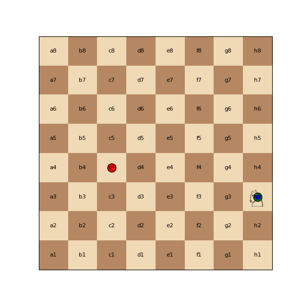

# Chess_Knight_Paths

**Chess_Knight_Paths** is a Python project that calculates all the minimum-length sequences for a knight to move from a starting cell to an ending cell on an empty chessboard. The project accepts positions in algebraic notation, prompts user input with suggestions, and generates comprehensive visualizations of the paths, including:

- **Graphviz DOT files**
- **PDF and PNG images** of the paths overlaid on a chessboard
- **Animated GIFs** showing the knight moving along each path

<p align="center">
  
</p>

---

## Table of Contents

- [Features](#features)
- [Requirements](#requirements)
- [Installation](#installation)
  - [Local Installation](#local-installation)
  - [Docker Installation](#docker-installation)
- [Usage](#usage)
  - [Running the Script](#running-the-script)
  - [Command-Line Arguments](#command-line-arguments)
  - [Examples](#examples)
- [Output Files](#output-files)
- [Project Structure](#project-structure)
- [Detailed Explanation](#detailed-explanation)
- [Troubleshooting](#troubleshooting)
- [Contributing](#contributing)
- [License](#license)
- [Acknowledgements](#acknowledgements)
- [About the Author](#about-the-author)

---

## Features

- **User-Friendly Input**: Prompts the user for starting and ending positions with helpful suggestions if not provided via command-line arguments.
- **Algebraic Notation Support**: Accepts chess positions in standard algebraic notation (e.g., `e4`, `h7`).
- **Visualizations**:
  - **Graphviz DOT Files**: Represents the shortest paths as graphs with start and end points marked.
  - **Chessboard Images**: Generates PDF and PNG images showing the paths overlaid on a chessboard with start and end points highlighted.
  - **Animated GIFs**: Creates animations of the knight moving along each path using a knight chess piece icon.
- **Detailed Logging**: Provides informative logs at different verbosity levels for easy debugging and understanding of the process.
- **Error Handling**: Includes comprehensive error handling for invalid inputs and missing dependencies, ensuring the script exits gracefully when issues arise.
- **Cross-Platform Compatibility**: Designed to work on Windows, macOS, and Linux systems.

---

## Requirements

### Python and Packages

- **Python 3.12.4** or higher
- **Python Packages** (listed in `requirements.txt`):
  - `graphviz`
  - `matplotlib`
  - `Pillow`
  - `numpy`
  - `imageio`

### System Dependencies

- **Graphviz**: Required for generating DOT files and visualizations.
- **Fonts**:
  - **DejaVu Sans**: Used for rendering the knight symbol ('♘') in the animations.
  - Alternatively, any font that supports the '♘' character.

---

## Installation

### Local Installation

#### 1. Clone the Repository

```bash
git clone https://github.com/AlviRownok/Chess_Knight_Paths.git
cd Chess_Knight_Paths
```

#### 2. Install System Dependencies

##### **For Windows**

1. **Install Graphviz**:

   - Download the installer from the [official website](https://graphviz.org/download/).
   - Run the installer and follow the instructions.
   - Add Graphviz to your system `PATH`:
     - Search for "Edit the system environment variables" in the Start Menu.
     - Click on "Environment Variables".
     - Under "System variables", select "Path" and click "Edit".
     - Click "New" and add the path to your Graphviz `bin` directory (e.g., `C:\Program Files\Graphviz\bin`).
     - Click "OK" to save changes.

2. **Install DejaVu Fonts** (if necessary):

   - Download the font from [DejaVu Fonts](https://dejavu-fonts.github.io/Downloads.html).
   - Install the `DejaVuSans.ttf` font by double-clicking and selecting "Install".
   - Alternatively, include the `DejaVuSans.ttf` file in your project directory.

##### **For macOS**

- Install Graphviz via Homebrew:

  ```bash
  brew install graphviz
  ```

##### **For Linux (Ubuntu/Debian)**

- Install Graphviz and fonts:

  ```bash
  sudo apt-get update
  sudo apt-get install graphviz fonts-dejavu-core
  ```

#### 3. Install Python Dependencies

It's recommended to use a virtual environment.

##### **Create a Virtual Environment**

```bash
python -m venv venv
```

##### **Activate the Virtual Environment**

- **Windows**:

  ```bash
  venv\Scripts\activate
  ```

- **macOS/Linux**:

  ```bash
  source venv/bin/activate
  ```

##### **Install the Dependencies**

```bash
pip install -r requirements.txt
```

### Docker Installation

If you prefer to run the project in a Docker container, follow these steps.

#### 1. Install Docker

- **Windows**: [Download Docker Desktop](https://www.docker.com/products/docker-desktop)
- **macOS**: [Download Docker Desktop](https://www.docker.com/products/docker-desktop)
- **Linux**: Install Docker Engine via your package manager.

#### 2. Build the Docker Image

```bash
docker build -t knight-paths .
```

#### 3. Run the Docker Container

```bash
docker run --rm -it -v "$(pwd):/app" knight-paths
```

**Note**: On Windows, you may need to adjust the volume mount path.

---

## Usage

### Running the Script

#### **Option 1: Interactive Mode**

Simply run the script without arguments, and it will prompt you for input.

```bash
python knight_paths.py
```

**Sample Interaction**:

```
Enter the starting position (e.g., 'd5' or 'a3'): e4
Enter the ending position (e.g., 'h7' or 'b1'): h7
INFO: Found 6 shortest path(s) from e4 to h7.
INFO: Graphviz DOT file saved to paths.dot
INFO: Paths overlaid on chessboard saved as paths.png and paths.pdf
INFO: Animation saved as paths.gif
```

#### **Option 2: Command-Line Arguments**

You can provide the starting and ending positions, output file name, and verbosity level directly.

```bash
python knight_paths.py -s e4 -e h7 -o knight_paths -v
```

### Command-Line Arguments

```bash
python knight_paths.py [-h] [-s START] [-e END] [-o OUTPUT] [-v]
```

- `-h`, `--help`: Show help message and exit.
- `-s START`, `--start START`: Starting position in algebraic notation (e.g., `e4`).
- `-e END`, `--end END`: Ending position in algebraic notation (e.g., `h7`).
- `-o OUTPUT`, `--output OUTPUT`: Output file name without extension (default: `paths`).
- `-v`, `--verbose`: Enable verbose logging for detailed output.

### Examples

- **Run with default settings and prompts**:

  ```bash
  python knight_paths.py
  ```

- **Specify starting and ending positions**:

  ```bash
  python knight_paths.py -s a1 -e h8
  ```

- **Specify output file name and enable verbose logging**:

  ```bash
  python knight_paths.py -s b2 -e g7 -o knight_paths -v
  ```

---

## Output Files

The script generates the following output files in your project directory:

1. **Graphviz DOT File**: `paths.dot`
   - A DOT file representing the shortest paths graphically.
   - Start nodes are marked in green, and end nodes in red.

2. **Chessboard Images**:
   - **PNG Image**: `paths.png`
   - **PDF Document**: `paths.pdf`
   - Visual representations of the paths overlaid on a chessboard.
   - Start positions are highlighted in green, end positions in red.

3. **Animated GIF**: `paths.gif`
   - An animation showing the knight moving along each path.
   - Uses a knight chess piece icon for visualization.

---

## Project Structure

```
Chess_Knight_Paths/
├── knight_paths.py       # Main script
├── requirements.txt      # Python dependencies
├── Dockerfile            # Docker configuration
├── .gitignore            # Git ignore file
├── README.md             # Project documentation
├── config.jsonc          # Configuration file (if used)
├── LICENSE               # License information
├── DejaVuSans.ttf        # Font file (if included locally)
└── paths.gif             # Sample animated GIF (output)
```

---

## Detailed Explanation

### **Script Workflow**

1. **Input Handling**:
   - The script accepts starting and ending positions in algebraic notation.
   - If not provided via command-line arguments, it prompts the user with suggestions.

2. **Coordinate Conversion**:
   - Converts algebraic notation to 0-based row and column indices for internal processing.

3. **Path Finding**:
   - Uses Breadth-First Search (BFS) to find all shortest paths from the start to the end position.
   - Only valid knight moves are considered.

4. **Visualization Generation**:
   - **Graphviz DOT File**:
     - Represents paths as graphs.
     - Nodes are chessboard squares.
     - Edges represent knight moves.
   - **Chessboard Images**:
     - Creates an 8x8 grid representing the chessboard.
     - Overlays the paths with different colors.
     - Marks start and end positions distinctly.
   - **Animated GIF**:
     - Generates frames showing the knight moving along each path step by step.
     - Compiles frames into an animation.

5. **Output Files Creation**:
   - Saves the generated visualizations in the specified formats.
   - Ensures files are saved with the appropriate extensions.

### **Key Components**

- **KnightPathFinder Class**:
  - Encapsulates the logic for path finding and visualization.
  - Methods include `bfs_paths`, `generate_graphviz`, `draw_paths_on_board`, and `create_animation`.

- **Error Handling**:
  - Validates inputs and provides informative error messages.
  - Handles exceptions during file generation and resource loading.

- **Logging**:
  - Uses Python's `logging` module to provide status updates and debug information.
  - Verbose mode (`-v`) enables detailed logs.

---

## Troubleshooting

### **Common Issues and Solutions**

- **Graphviz Not Found**:
  - **Error Message**: `graphviz.backend.ExecutableNotFound: failed to execute ['dot', '-Kdot', '-Tdot', '-O', 'filename'], make sure the Graphviz executables are on your systems' PATH`
  - **Solution**: Ensure Graphviz is installed and added to your system `PATH`.

- **Font Loading Error**:
  - **Error Message**: `Font could not be loaded: cannot open resource`
  - **Solution**: Make sure the `DejaVuSans.ttf` font is installed or included in your project directory. Modify the font path in the script if necessary.

- **Knight Image Not Displaying**:
  - **Issue**: The knight symbol does not appear in the animations.
  - **Solution**: Verify that the font used supports the '♘' character or use an image file for the knight.

- **Dependencies Not Installed**:
  - **Error Message**: `ModuleNotFoundError: No module named 'module_name'`
  - **Solution**: Install missing dependencies using `pip install -r requirements.txt`.

- **Permission Errors When Using Docker**:
  - **Issue**: Files generated inside the Docker container have incorrect permissions.
  - **Solution**: Adjust Docker run command or file permissions as needed.

---

## Contributing

Contributions are welcome! If you'd like to contribute to this project, please follow these steps:

1. **Fork the Repository**: Click the "Fork" button on the GitHub page.

2. **Clone Your Fork**:

   ```bash
   git clone https://github.com/your_username/Chess_Knight_Paths.git
   ```

3. **Create a New Branch**:

   ```bash
   git checkout -b feature/your_feature_name
   ```

4. **Make Your Changes**: Implement your feature or fix.

5. **Commit Your Changes**:

   ```bash
   git commit -am "Add your commit message here"
   ```

6. **Push to Your Fork**:

   ```bash
   git push origin feature/your_feature_name
   ```

7. **Submit a Pull Request**: Go to the original repository and open a pull request.

---

## License

This project is licensed under the **MIT License**. See the [LICENSE](LICENSE) file for details.

---

## Acknowledgements

- **Graphviz**: For providing powerful graph visualization tools.
- **Matplotlib**: For making data visualization in Python accessible and versatile.
- **Pillow**: For easy image creation and manipulation.
- **Contributors**: Thank you to everyone who has contributed to this project.

---

## About the Author

**Name**: Alvi Rownok  
**Email**: [alvi2241998@gmail.com](mailto:alvi2241998@gmail.com)  
**LinkedIn**: [https://www.linkedin.com/in/alvi-rownok/](https://www.linkedin.com/in/alvi-rownok/)

---

Feel free to reach out if you have any questions or need further assistance with the **Chess_Knight_Paths** project. Enjoy exploring the fascinating paths of the knight!